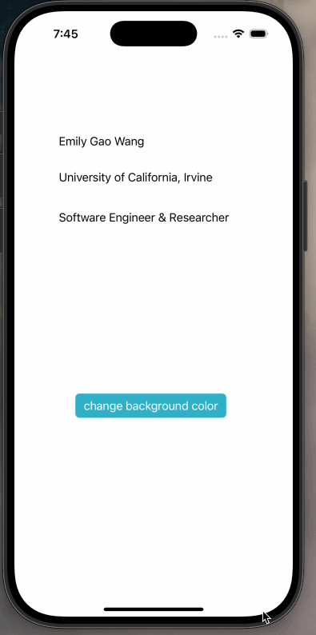

# Prework - *Change background color*

Submitted by: **Emily Gao Wang**

**Change background color** is an app that click on a button to change to random background color 

Time spent: **0.5** hours spent in total

## Required Features

The following **required** functionality is completed:

- [✔️] Users are see a screen with three labels and a button
- [✔️] Tapping the button changes the screen color to a random color
 
## Video Walkthrough

## App Brainstorming (Step 4)
Notion
  - Flexible templates for organization.
  - Syncing across devices.

App Idea:
  - I want to build a habit-tracking app. It will help users track daily habits like drinking water, exercising, or reading. The app will include reminders, progress charts, and motivational badges. Users can also share their progress with friends for encouragement. This app will be simple and fun to use, helping people stay consistent with their goals.

## Notes

The instructions are clear and easy to follow.

## License

    Copyright [yyyy] [name of copyright owner]

    Licensed under the Apache License, Version 2.0 (the "License");
    you may not use this file except in compliance with the License.
    You may obtain a copy of the License at

        http://www.apache.org/licenses/LICENSE-2.0

    Unless required by applicable law or agreed to in writing, software
    distributed under the License is distributed on an "AS IS" BASIS,
    WITHOUT WARRANTIES OR CONDITIONS OF ANY KIND, either express or implied.
    See the License for the specific language governing permissions and
    limitations under the License.
